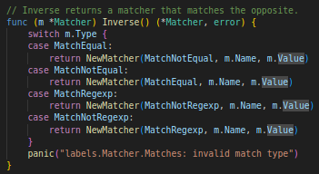

# Cognit-Go

## Cognitive Complexity in Go

## Scott Nicholas Allan Smith

## London Gophers

## 2024-09-18

---

# About Me

- Clojure + a bit of React/TS for the last year at Riverford Organic Farmers
- Go, Python, Java, React/TS for the previous two years at Open Cosmos
- Worked on microservices & monoliths, cloud & local & embedded applications
- Growing along the path to becoming a tech lead or staff/principle engineer
- Aspiring to give more technical & conference talks
- For fun: kayaking, woodworking, reading, learning languages, eating/cooking food

---

# Where Are We Going?

Aims

- Introduce some micro (function) level complexity measures
- Calculate these on some Go code snippets for comparison
- Discuss linting for them in fresh or not-so-fresh codebases
- Explain why cognitive complexity can be a good tool in your toolbox

---

# Where Are We Going?

Non-Aims

- Have everyone linting for cognitive complexity tomorrow in their codebases
- Claim to solve all of your code complexity problems with this one weird trick

---

# A Taxonomy of Complexities \*

\* Less pretentiously: types of complexity \*\*

\*\* or not even really complexity [https://www.youtube.com/watch?v=vzfy4EKwG_Y](https://www.youtube.com/watch?v=vzfy4EKwG_Y)

---

# A Taxonomy of Complexities

_Macro level_

**Essential** - complexity that is inherent in the domain that you're working on

Something that the business has decided must happen because it's "valuable"

e.g. we deliver to a certain customer on a given weekday and never to any customer on a Sunday, except for near Christmas where the weekday is moved around so each customer gets their delivery, as close to Christmas as possible including potentially on Sundays

---

# A Taxonomy of Complexities

_Macro level_

**Incidental** - complexity introduced due to e.g. technological/code choices

Not a business rule/doesn't add value
Must happen because of some technology choice (good or bad)

e.g. we're a team of 5 engineers with 10000 daily users

To know the customers delivery date you have to call out to the 
delivery date microservice who is the only one who knows delivery date logic

We look after 10 microservices each

Basically the classic Krazam https://www.youtube.com/watch?v=y8OnoxKotPQ

---

# A Taxonomy of Complexities

At a _micro_ (code/per function) _level_

- **Cyclomatic**

- **Cognitive**

both measure complexity on the scale of individual functions (or code snippets)

---

# Cyclomatic Complexity

A mathematical concept

Formally, the number of linearly independent paths through a piece of code

More informally, counts the "decision points" in a block of code

Consequently ~ number of tests you would have to write to cover all paths in a function

We'll see some examples of how to calculate this in a bit

---

# Cognitive Complexity

From G. Ann Campbell at SonarSource - corporate, so make of that what you will \*

Tries to account for intuition about "hard to understand" code in its rules

(i.e. more vibes based than formal)

Key departures from cyclomatic complexity

- switch/case +1 to complexity, regardless of cases, rather than + number of cases
- nested "decisions" count progressively more towards complexity
- boolean operations are counted "per group" rather than "per operation"
- +1 to complexity on recursion

This will become much clearer with the following examples

\* full white paper here [https://www.sonarsource.com/docs/CognitiveComplexity.pdf](https://www.sonarsource.com/docs/CognitiveComplexity.pdf)

---

# Calculating Cyclomatic Complexity of Go Code

All code shamelessly stolen & possibly slightly adapted from Prometheus [https://github.com/prometheus](https://github.com/prometheus) unless stated otherwisse

---

# Calculating Cyclomatic Complexity of Go Code

`for` implies an `if` - `if` no elements left to iterate over

---

# Calculating Cyclomatic Complexity of Go Code

Paths through the code

---

# Calculating Cyclomatic Complexity of Go Code

Linearly independent paths = # of decisions + 1 ⟹ 5

---

# Calculating Cognitive Complexity of Go Code

Basically, cyclomatic + adjustments for cognitive

5 paths + 1 nesting penalty ⟹ 6

---

# Cyclomatic vs Cognitive Complexity - Switch

4 paths through switch + 1 path after ⟹ 5 cyclomatic complexity

---

# Cyclomatic vs Cognitive Complexity - Switch

switch always counts as +1 ⟹ ~~4~~ 1 + 1 ⟹ 2 cognitive complexity

---

# Cyclomatic vs Cognitive Complexity - && ||

Can take a minute to grok path counting through boolean expressions

4 paths, 1 from if, 3 from logical operators ⟹ +4 cyclomatic complexity

---

# Cyclomatic vs Cognitive Complexity - && ||

Does this align with our intuition about sequences of logical operations?

---

# Cyclomatic vs Cognitive Complexity - && ||

`a && b || c && d` 3 decisions ⟹ +3 cyclomatic complexity
`a && b || c && d` 3 sequences of like operations ⟹ +3 cognitive complexity                     

`a && b && c && d` 3 decisions ⟹ +3 cyclomatic complexity
`a && b && c && d` 1 sequence of like operations ⟹ +1 cognitive complexity

---

# Contrasting Cyclomatic and Cognitive Complexity

Each level of nesting incurs +1 penalty
Hence this snippet has cognitive complexity 9 already!

---

# Why Should I Care? Fits-In-My-Headness

Both measures ~ proxy for function size

More flexible than "function length" limit

Long functions of many simple operations are still low complexity

Helps you to optimise for "fits-in-my-head"-ness \*

\* [https://www.youtube.com/watch?v=4Y0tOi7QWqM](https://www.youtube.com/watch?v=4Y0tOi7QWqM)

---

# Why Should I Care? Chunking

The more branching/decisions in a function...
... the less likely it'll fit in working memory
... the longer it will take to understand

We want to split this into smaller "chunks" of logic

- how we hold larger systems in our mind from smaller ones (_chunking_)
- naming chunks (functions) is the most "to hand" way to document intent

Ideas on this slide put into words by _The Programmer's Brain_ by _Felienne Hermans_
[https://www.manning.com/books/the-programmers-brain](https://www.manning.com/books/the-programmers-brain)

---

# Linting For Cognitive Complexity in New Go Code

Luckily, this is super easy!

`golangci-lint` (you are using that, right?) has inbuilt support via the `gocognit` linter 

[https://golangci-lint.run/usage/linters/#gocognit](https://golangci-lint.run/usage/linters/#gocognit)

Don't forget to set a nice low value!

My own recommendation: try 10, if it's too limiting, try 15 or 20

---

# Ulysses Pact

From [https://en.wikipedia.org/wiki/Ulysses_pact](https://en.wikipedia.org/wiki/Ulysses_pact)

> A Ulysses pact or Ulysses contract is a freely made decision that is designed and intended to bind oneself in the future

---

# Ulysses Pact in Software Development

An example could be

- We believe `golangci-lint`'s default linters are valuable because they
    - capture potential bugs much earlier than tests, etc...
    - improve the quality/reliability/etc... of our code

Consequently

- We always use `golangci-lint`'s default linters
- We never disable linting for any of those linters in comments
- We enforce the above in CI

--- 

# Ulysses Pact - More Background

> The term refers to the pact that Ulysses ... made with his men as they approached the Sirens. Ulysses wanted to hear the Sirens' song although he knew that doing so would render him incapable of rational thought. He put wax in his men's ears so that they could not hear and had them tie him to the mast so that he could not jump into the sea. He ordered them not to change course under any circumstances and to keep their swords upon him and to attack him if he should break free of his bonds.
Upon hearing the Sirens' song, Ulysses was driven temporarily insane and struggled with all of his might to break free so that he might join the Sirens, which would have meant his death. His men, however, kept their promise, and they refused to release him.

---

# Ulysses Pact in Greenfield Projects

There's always eventually the temptation to ignore the linter
_It's just one function... It's not that complex, right?..._
_Surely I/the new started will understand it in 6 months..._

Decision taken 10s/100s/1000s of times in a codebase

Many things are a little harder to grok ⇨ lots of slow down

I like to call this _death by a thousand **what**?s_

Basically

- we find a rule that we believe will always be beneficial for the codebase
- we set up some way to enforce that rule (e.g. a linter)
- we bind ourselves always to follow that rule in future

---

# Cognitive Complexity Linting in Legacy Go Code

Oh no, there's a big pile of legacy code with huge cognitive complexity!

How can we force the complexity of this codebase down over time?

Using a **Ratchet** / **Ratcheting**\*

- Find a metric that you want to improve around a codebase
- Introduce a tool that can measure that metric automatically
- Establish the current value of that metric
- Put that tool into CI, blocking merges/etc... if it increases

\* [https://martinfowler.com/articles/useOfMetrics.html#MetricsAsARatchet](https://martinfowler.com/articles/useOfMetrics.html#MetricsAsARatchet) or [https://bugroll.com/how-to-refactor-incredibly-bad-code-a8443cb0da86](https://bugroll.com/how-to-refactor-incredibly-bad-code-a8443cb0da86)

---

# Cognitive Complexity Linting in Legacy Go Code

As a bonus, a _self-tightening ratchet_ \*

- Dynamically measure the current value of the metric (e.g. on `main`)
- Do not allow a commit/branch to increase the metric above this value

Now the metric can be decreased, but never increased, forcing improvement over time!

\* I've seen this used a few times, but never named

---

# To Summarise

## Key Takeaways

- A function level complexity measure that roughly aligns with intuition
- Linting is easily available for Go codebases (and many other languages)
- IMO limiting cognitive complexity is a good, intelligent way to limit function size
    - helps us to optimise for "fits-in-my-head"-ness of functions
    - forces us to think about how we should chunk our code

---

# To Summarise

## Concepts / Names

- A **Ulysses Pact** is an agreement we make now that binds us in future
- A **ratchet** can be used to improve any measureable in a codebase over time

---

# Thanks!

For listening

Please give brutally honest feedback and criticism

[https://uk.linkedin.com/in/scottnasmith](https://uk.linkedin.com/in/scottnasmith)
